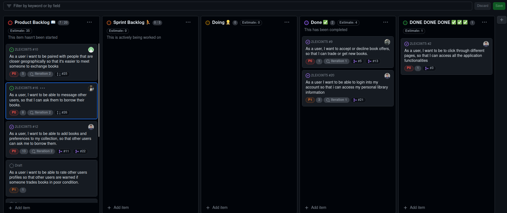
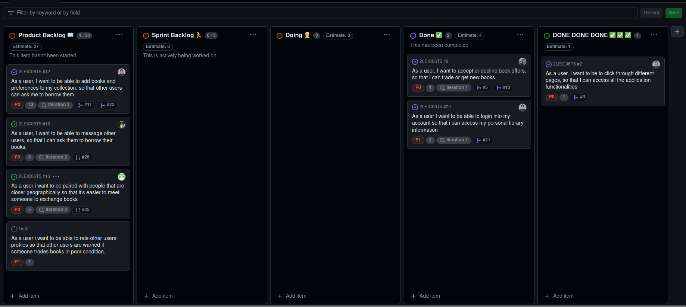

# Pagepal

Find your perfect reading match!

With **Pagepal**, we aim to reduce waste. Like us, you probably have a ton of books, sitting on your shelves, that will probably never be read again. Wouldn't it be great if you could put those books to good use, and in turn, get new books to read at no cost? With **Pagepal**, you can! With our taste-matching system, you can find someone with a book you will love and ask that person for books. If you give a book, you can get a book, while using our *Book Credits* system.

## High-Priority Features Definition

- User profile
  - personal library of books
  - definition of taste in books
  - *Book Credits*
- Messaging system
- Book-matching system (*tinder-like*; if user **A** likes genre **X**, and user **B** has a book of genre **X**, **A** can ask **B** for that book, and if **B** accepts, he will earn book credits)
- Prioritize closer offers based on Geolocation.
- Swipe System
- Book rating system

## Medium-Priority Features
- Rating other people's profiles (like Uber)
- Blind Exchange: A user can be available for a random exchange skipping the swiping process.

## Low-Priority Features
- System to add new books to the database
- System to payment

## Book Credits

This is a system where one can earn book credits when giving a book to someone and can spend them by lending books from others.

## Domain Model

## Component Diagram

## Logical Architecture
The following image represents the PagePal Package Diagram:

Our system can easily be divided into 2 parts setting up book switches and maintaining accurate user library information.

Setting up book switches:
    Book Switch: Represents the creation of a new "book switch" event after 2 matching users show interest in each other's books.
    Planned Switch: Represents the default matching process where each user finds a book they want belonging to another user.
    Blind Switch: Represent an option for a switch where only 1 user finds a book they want in another user's collection.
    Texting in App: Represents the functionality for matched users to send messages to each other.
    Customer Rating: This represents the user's option to, after a book switch ends, leave a 1-5 start review and a comment on how the other user treated their book.

Maintaining Accurate User Library:
    Book Database: Represents the books users are allowed to add to their database together with its information like author, summary, etc.
    Customer Database: Represents all user's information such as name, password, review score, etc.
    Customer: Simply represents the public information of a single user in the database like its collection and review score.
    Personal Library: Represents the books a user has available for trading.

## Physical Architecture

Our Deployment Diagram is composed of two parts, the PagePal app that present in each user phone and the Google Server that contains the FireBase system used to store PagePal information.

## Sprint Review and Retrospective

### SPRINT 1

+ Done:
  + Authentication
  + Database integration
  + Fix Widget Displacement

+ Doing:
  + Messages page
  + Pairing algorithm
  + Profile Page

+ Puzzles:
  + Epics instead of user stories
  + Communication problems
  + Bad Expectations

Before:

After:

### SPRINT 2

+ Done:
  + Tests

+ Doing:
  + Messages page
  + Pairing algorithm
  + Profile Page

+ Puzzles:
  + Communication problems
  + Bad Expectations

Before:

After:

### SPRINT 3

+ Sprint Planning: Since the result on the previous sprints were not as expected, we decided to cut some of the feature and focus what is really important. Then we decided to remove the settings and search users stories and give total focus on the main aspects of the app.

Before:
